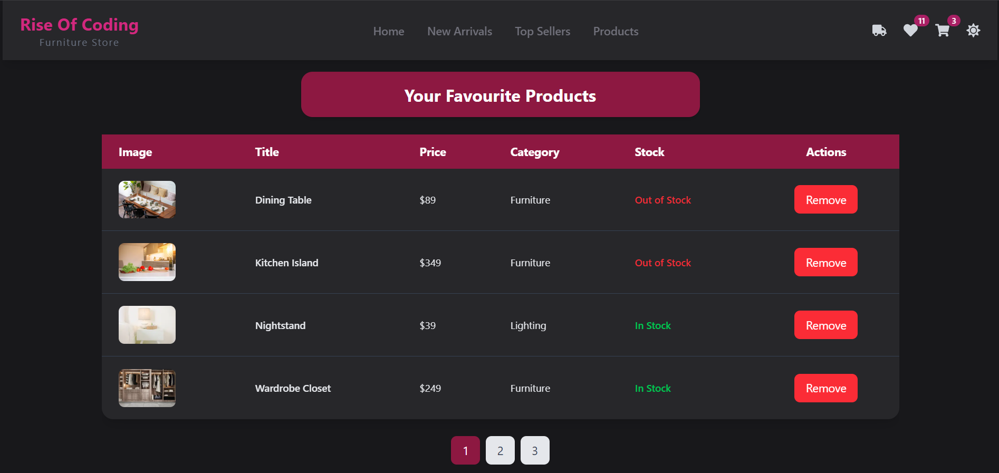

# 🛋️ Modern Furniture Store

A modern **Furniture E-commerce Store** built with the latest technologies.  
It includes advanced features such as **Add to Cart**, **Wishlist**, **Dark Mode**, **Pagination**, **Local Storage**, and smooth animations with **Framer Motion**.

---

## 🚀 Features

- 🛒 **Add to Cart** – Seamlessly add and manage products in the cart.  
- 💖 **Wishlist (Favorites)** – Save items you love for later.  
- 🌙 **Dark Mode** – Modern dark/light theme toggle.  
- 📑 **Pagination** – Browse products with smooth client-side pagination.  
- 💾 **Local Storage** – Persistent data (Cart & Wishlist saved even after refresh).  
- 🎭 **Framer Motion Animations** – Smooth and elegant UI transitions.  
- 📱 **Responsive Design** – Optimized for all devices (Mobile, Tablet, Desktop).  

---

## 🛠️ Tech Stack

- ⚡ [Next.js 15.4.5 (Turbopack)](https://nextjs.org/) – React Framework  
- 🎨 [Tailwind CSS](https://tailwindcss.com/) – Utility-first CSS framework  
- 🎭 [Framer Motion](https://www.framer.com/motion/) – Animation library  
- 🔥 [React Hot Toast](https://react-hot-toast.com/) – Notifications  
- 🌀 [React Slick](https://react-slick.neostack.com/) – Product slider  
- ⚛️ [Redux Toolkit](https://redux-toolkit.js.org/) – State management  
- 📖 [React Paginate](https://github.com/AdeleD/react-paginate) – Pagination component  

---

## 📸 Screenshots

### 🏠 Home Page


### 🏠 Products


### 🛒 Cart Page


### 💖 Wishlist


---

## 📂 Project Structure

The project is organized with a clean and modular structure to ensure scalability and maintainability:

📦 src
┣ 📂 app
┃ ┣ 📂 cart
┃ ┃ ┣ 📜 CartPage.jsx
┃ ┃ ┗ 📜 page.jsx
┃ ┣ 📂 checkout
┃ ┣ 📂 home
┃ ┣ 📂 new-arrivals
┃ ┃ ┗ 📜 page.jsx
┃ ┣ 📂 products
┃ ┃ ┣ 📜 page.jsx
┃ ┃ ┗ 📜 Products.jsx
┃ ┣ 📂 styles
┃ ┃ ┣ 📜 darkMode.css
┃ ┃ ┗ 📜 globals.css
┃ ┣ 📂 top-sellers
┃ ┣ 📂 wishlist
┃ ┃ ┣ 📜 page.jsx
┃ ┃ ┗ 📜 Wishlist.jsx
┃ ┣ 📜 layout.js
┃ ┗ 📜 page.js
┣ 📂 components
┃ ┣ 📜 CardCarousel.jsx
┃ ┣ 📜 Categories.jsx
┃ ┣ 📜 LoadingSpinner.jsx
┃ ┣ 📜 Navbar.jsx
┃ ┣ 📜 NewArrivals.jsx
┃ ┣ 📜 ProductCard.jsx
┃ ┣ 📜 ReduxProvider.jsx
┃ ┣ 📜 SliderComponent.jsx
┃ ┗ 📜 TopSellers.jsx
┣ 📂 lib
┃ ┣ 📜 cartSlice.js
┃ ┣ 📜 store.js
┃ ┗ 📜 wishlistSlice.js
┣ 📂 utils
┃ ┗ 📜 localStorage.js
┗ 📜 .gitignore
---

## ⚙️ Installation & Setup

## ⚙️ Installation & Setup

1. Clone the repository  
   ```bash
   git clone https://github.com/aymantarek16/furniture-store.git

2. Navigate to the project folder
cd furniture-store


3. Install dependencies
npm install


4. Run the development server
npm run dev

5. Open http://localhost:3000 in your browser 🚀
